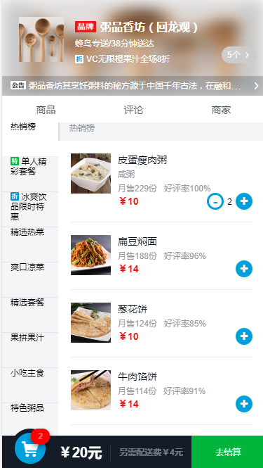
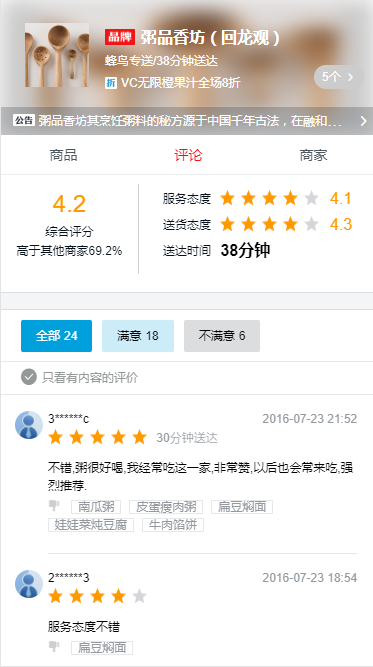

# eleme(饿了么app)

> A Vue.js project
>
> 首先，非常欢迎大家来的我github ，这是我做的第一个相对完整的练手项目，项目效果虽然实现了，但是后面还需要对代码进行一定的优化 ，效果图如下：
>
> 如果大家觉得还不错的话，希望能给我一个star~谢谢~~

 


## demo展示 ##

    


## 实现技术 ##

- vue-2.0
- axios
- better-scroll    https://github.com/ustbhuangyi/better-scroll
- moment    http://momentjs.cn/
- cubic-bezier曲线    http://cubic-bezier.com/#.17,.67,.83,.67
- stylus    http://www.zhangxinxu.com/jq/stylus/

## 功能点 ##

- 左右侧商品联动
- 滚动列表（纵向及横向）
- 购物app常见的小球飞入购物车动画
- 以及移动端项目常见的一些小技巧

## 项目组件 ##

做vue项目最大的体验就是：组件化的思想，很多模块可以复用

独立出来的组件，如下：

- 评分组件（显示star）
- 评价列表（控制评价内容的显示类型）
- 加入购物车组件
- 分隔区域（虽然该组件代码量少的可怜，也很简单，但是抽象成组件，多个地方复用还是会更方便的）
- 价格显示组件
- 其实项目中只要有共同功能点的都可以独立成组件


关于项目中遇到一些坑查阅的资料：

> better-scroll:
>
> http://blog.csdn.net/myfuture_mydream/article/details/63359463
>
> http://www.imooc.com/article/18232


> vue2.0组件间事件派发与接收
>
> https://segmentfault.com/a/1190000008018314
>
> http://blog.csdn.net/wangxiaoxiaosen/article/details/75258013


> vue2.0 子组件改变props值，并向父组件传值
>
> http://blog.csdn.net/o_Mario_o/article/details/77035451
>
> http://www.cnblogs.com/huyongyong/p/7079206.html


> axios
>
> http://blog.csdn.net/u012369271/article/details/72848102
>
> http://blog.csdn.net/oxgos/article/details/73810316
>
> https://segmentfault.com/q/1010000008669725/a-1020000008670066


> elemeApp主要功能点汇总
>
> http://www.cnblogs.com/yujihang/p/6886532.html


## Build Setup

``` bash
# install dependencies
npm install

# serve with hot reload at localhost:8080
npm run dev

# build for production with minification
npm run build

# build for production and view the bundle analyzer report
npm run build --report
```


## 补充说明 ##

> 最后，但也很重要的一点。本实战项目是在学习了慕课网huangyi老师的高仿饿了么外卖App课程的基础上做的。感谢黄老师~


For detailed explanation on how things work, checkout the [guide](http://vuejs-templates.github.io/webpack/) and [docs for vue-loader](http://vuejs.github.io/vue-loader).

